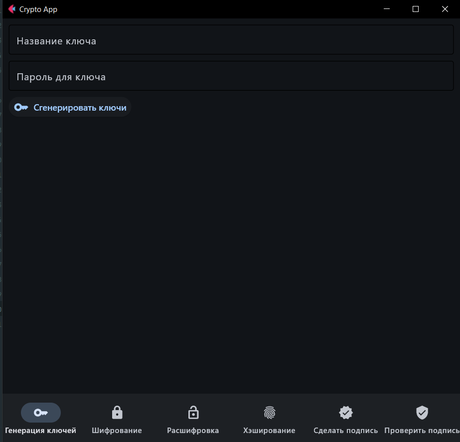
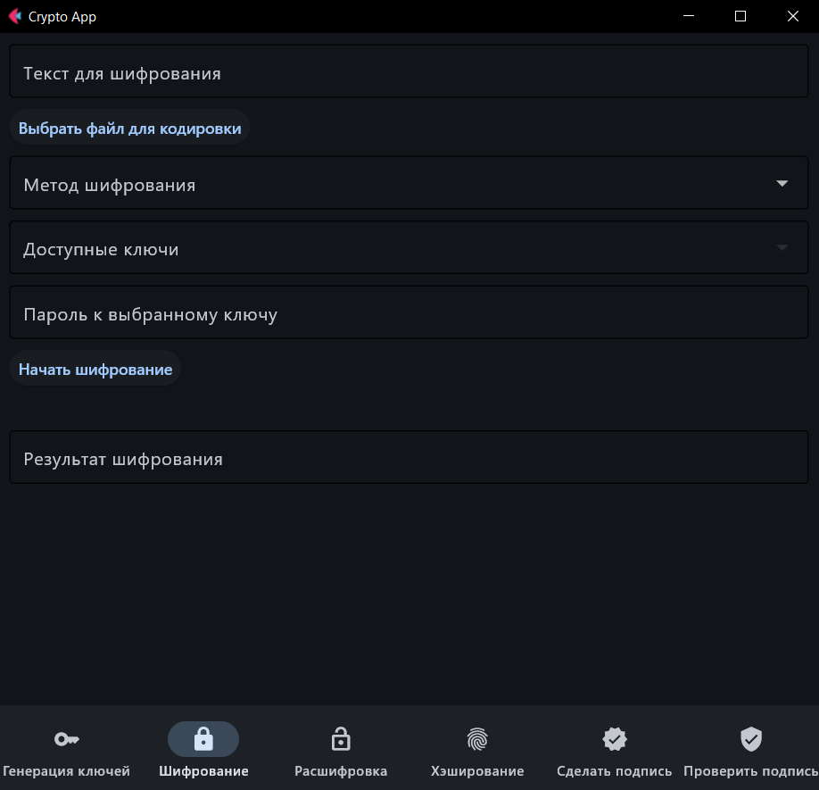
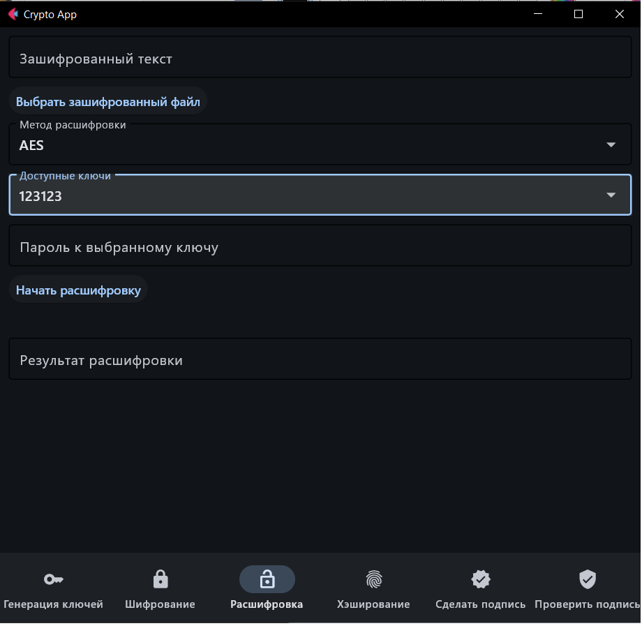
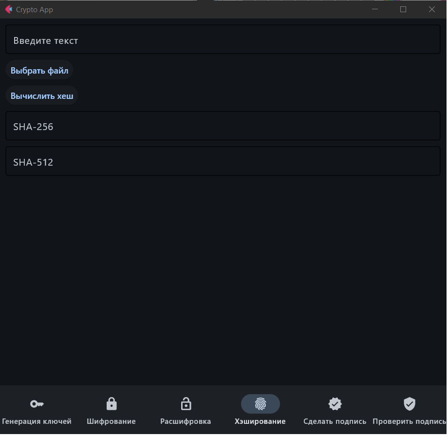
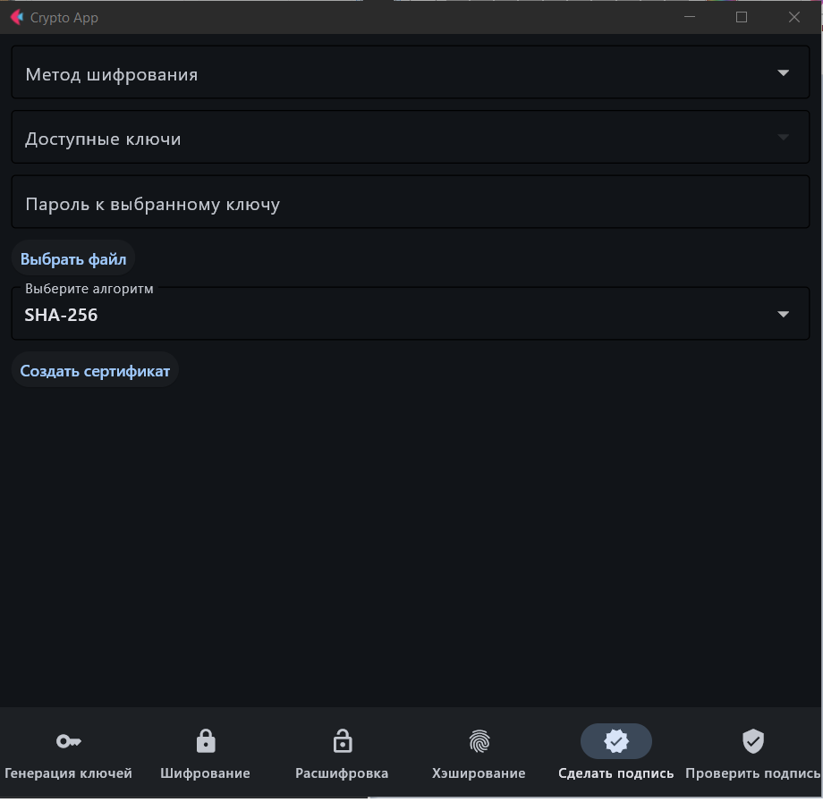

# 🔐 CryptoKurc

## 📌 Описание проекта
**CryptoKurc** — это Python-приложение для работы с криптографией, включая шифрование, дешифрование, хеширование и управление ключами. Проект использует библиотеку **Flet** для графического интерфейса.

---

## 🚀 Функциональность
- 🔑 **Генерация ключей** (AES, RSA)
- 🔏 **Шифрование и дешифрование** данных
- 🖋️ **Создание и проверка цифровых подписей**
- 🛡️ **Хеширование данных**
- 🖥️ **Графический интерфейс** на Flet

---
## 📂 Скриншоты функционала

### 🔑 Генерация ключей


### 🔏 Шифрование данных


### 🔓 Дешифрование данных


### 🛡️ Хеширование строки


### 🖋️ Создание хеш-файла


### 🔎 Проверка хеш-файла


---
## 📂 Структура проекта
```plaintext
CryptoKurc/
│── models/            # Модели приложения
│── pages/             # Основные страницы приложения
│── utils/             # Вспомогательные модули
│── main.py            # Точка входа в приложение
│── requirements.txt   # Список зависимостей
│── rsa_keys.json      # Хранилище RSA-ключей
│── aes_keys.json      # Хранилище AES-ключей
│── README.md          # Этот файл
```

---

## 🔧 Установка и запуск

### 1️⃣ Клонирование репозитория
```sh
git clone https://github.com/your-username/CryptoKurc.git
cd CryptoKurc
```

### 2️⃣ Создание виртуального окружения
```sh
python -m venv venv
source venv/bin/activate  # macOS/Linux
venv\Scripts\activate      # Windows
```

### 3️⃣ Установка зависимостей
```sh
pip install -r requirements.txt
```

### 4️⃣ Запуск приложения
```sh
python main.py
```

---

## 🛠 Используемые библиотеки
- **PyCryptodome** — реализация криптографических алгоритмов
- **Flet** — создание графического интерфейса
- **PyInstaller** — упаковка в исполняемые файлы

---

## 🤝 Контрибьютинг
Хотите помочь проекту``` Будем рады вашему вкладу!

1. **Форкните** репозиторий.
2. **Создайте новую ветку** (```sh git checkout -b feature-branch ```).
3. **Добавьте изменения** и закоммитьте (```sh git commit -m "Добавлена новая фича" ```).
4. **Запушьте** ветку (```sh git push origin feature-branch ```).
5. **Создайте Pull Request**.

---

## 📜 Лицензия
Этот проект распространяется под **MIT License**. Полный текст лицензии доступен в файле `LICENSE`.

---

## 📞 Контакты
Если у вас есть вопросы или предложения, свяжитесь со мной через GitHub.

🚀 **Развивайте проект и используйте его на здоровье!** 😊
